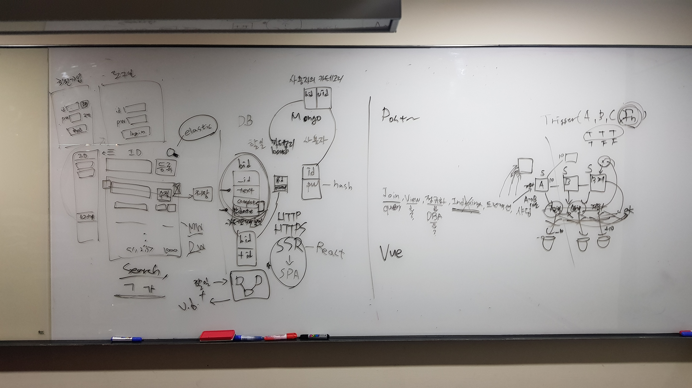
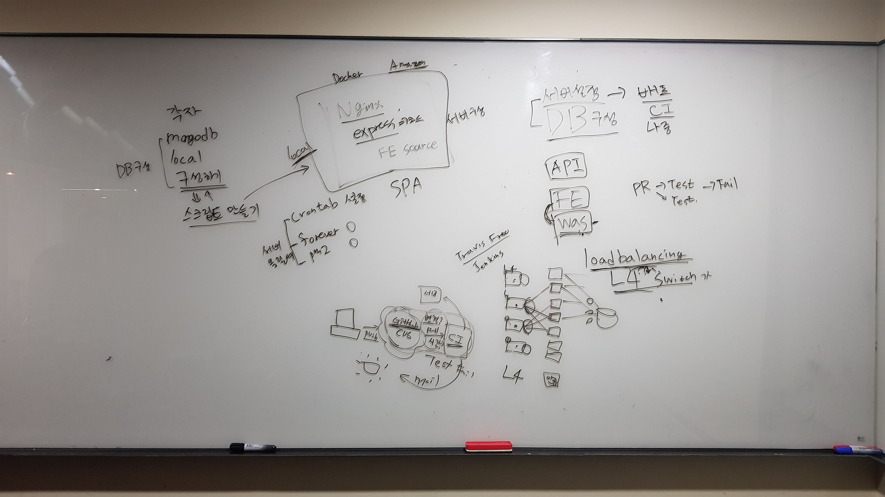

# Day3 회의 

## 회의 정리 1 

### Summary
- 기획 
- 화면 구성 
- DB 구성 
- 추후 확장 

### 페이지 (이미지 참고)
- 회원가입
- 로그인
- 본문

### DB
- 사용자 테이블
- 할일 테이블
- 카테고리 테이블

### FE
- React
- SPA

### DB관련 용어 (추가 정리 필요)
- Join
- View
- Normalization
- Indexing
- Transaction
- Sharding

### Protocol
- http로 먼저 진행하고 https를 차후에 적용

## 회의 정리 2 

- 디비 구성 
- 서버 구성 
- FE, WAS 구성 

## 결론 

### 숙제 
- 각자 mongodb 구성해보기 

### 다음 주 
- local mongodb 설치 및 환경 구성 스크립트 만들기 
- Server-side 환경 구성 스크립트 만들기 